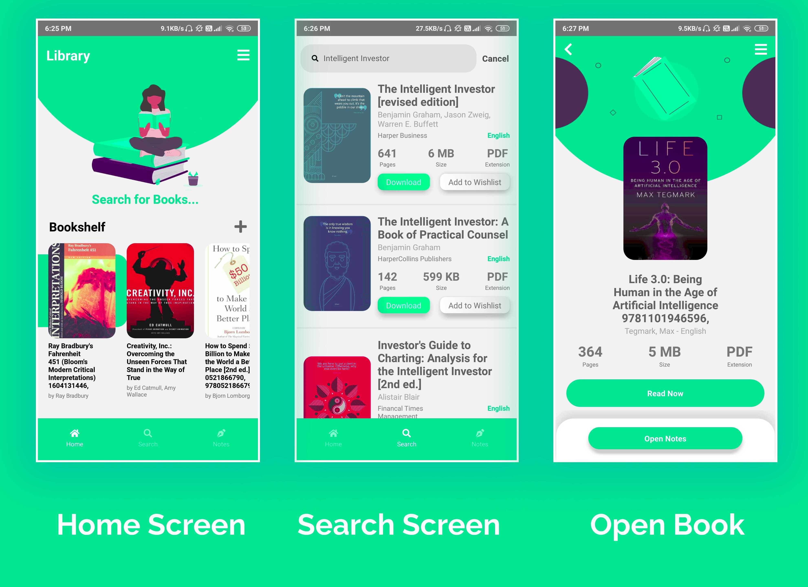

# Curiosity-Book-App
> This was a personal project, made out of the curiosity to read books and the unavailability of good e-book readers with the note taking functionality that I wanted.<br/>

The app has the following features:<br/>

1. Download any book you like.
2. Save the books in the app itself.
3. Read with a built-in pdf Reader.
4. Create Notes, with features like Adding Tags to track important Highlights/Notes.

## Steps to Start
Feel free to pull and use the app. Run the following commands:

```javascript
npm install 
```
```javascript
react-native run-android 
```
```javascript
react-native start
```

## Screenshots

<p float="left" >
  
   
</p>

## PS:
DM to get the key, to run the app.
<!--   -->
